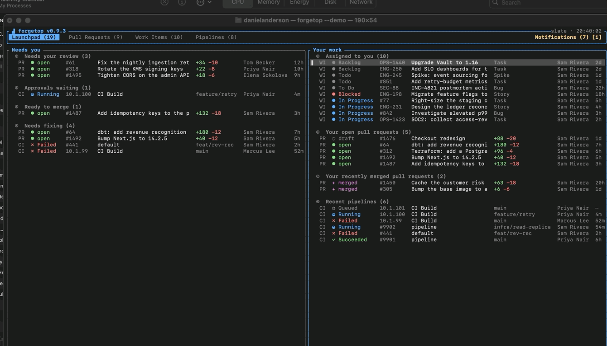

# forgetop

A fast, keyboard-driven terminal UI for your pull requests, work items, and CI
pipelines - across **GitHub**, **GitLab**, **Azure DevOps**, **Linear**, **Jira**,
and **Bitbucket** - in one place.

📖 **Docs: [magna-nz.github.io/forgetop](https://magna-nz.github.io/forgetop/)**

[](https://github.com/magna-nz/forgetop/actions/workflows/ci.yml)
[](https://github.com/magna-nz/forgetop/releases/latest)
[](https://magna-nz.github.io/forgetop/)
[](https://www.rust-lang.org)
[](LICENSE)

<div align="center">
  
  <br/>
  <sub>Live dashboard - Pull Requests, Work Items, Pipelines.</sub>
</div>

---

Modern teams spread work across several forges. forgetop pulls your pull requests,
work items, and pipelines into one terminal dashboard - and lets you *act* on them
(approve, merge, comment, change state, drill into pipeline stages, trigger runs)
without leaving the keyboard. Tokens live in your OS keychain, never in plaintext.

## The Launchpad

forgetop opens on the **Launchpad** - one cross-provider queue answering *what needs me
right now?* Every PR, work item, and pipeline that needs you - across every connected
forge - lands on a single page, ordered by urgency, in two columns:

- **Needs you** - reviews requested of you, pipeline gates to approve, PRs ready to
  merge, and anything of yours that's broken.
- **Your work** - your assigned tickets, open PRs, and recent merges.

So instead of checking GitHub for reviews, Azure for failing builds, and Jira for
tickets, you start your day on one triaged list - every item in the same shape, so
they're comparable at a glance - and act on any of them inline. No tab-hopping, nothing
slipping through the cracks.

<div align="center">
  
  <br/>
  <sub>The Launchpad: everything that needs you, across every forge, on one page.</sub>
</div>

See the [Launchpad docs](https://magna-nz.github.io/forgetop/#launchpad) for the full
bucket rules and keys.

## Why forgetop

Two popular TUIs inspired this: [gh-dash](https://github.com/dlvhdr/gh-dash) (GitHub only)
and [azdo](https://github.com/Elpulgo/azdo) (Azure DevOps only). forgetop's angle is
**one keyboard-driven tool across every forge**, with equal footing for code review
*and* CI.

| Capability | forgetop | gh-dash | azdo |
| :--- | :---: | :---: | :---: |
| Forges supported | **6** | GitHub | Azure |
| Cross-provider action inbox (Launchpad) | ✅ | ❌ | ❌ |
| PRs + Work items + Pipelines | ✅ | PRs only | ✅ Azure |
| Act (approve / merge / comment) | ✅ | ✅ PRs | partial |
| Inline line-comment review | ✅ | preview | ❌ |
| Pipeline drill-in + logs | ✅ | ❌ | ✅ |
| Approve pipeline gates in-terminal | ✅ | ❌ | ❌ |
| Filter · sort · saved prefs | ✅ | ✅ | limited |
| Cross-provider aggregation | ✅ | ❌ | ❌ |
| Desktop notifications | ✅ | ❌ | ❌ |
| Tokens in OS keychain | ✅ | via `gh` | PAT |

## Providers

Each section binds to a provider that supports it; the Pipelines section can
aggregate several at once.

| Provider | Pull Requests | Work Items | Pipelines |
| --- | :---: | :---: | :---: |
| **GitHub** | ✅ | ✅ (Issues) | ✅ (Actions) |
| **GitLab** | ✅ (MRs) | ✅ (Issues) | ✅ (CI) |
| **Azure DevOps** | ✅ | ✅ | ✅ (Builds) |
| **Bitbucket** | ✅ | - | ✅ (Pipelines) |
| **Linear** | - | ✅ | - |
| **Jira** | - | ✅ | - |
| **Demo** | ✅ | ✅ | ✅ |

## Install

**Homebrew** (macOS / Linux):

```sh
brew install magna-nz/tap/forgetop
```

**Shell installer** (macOS / Linux):

```sh
curl --proto '=https' --tlsv1.2 -LsSf https://github.com/magna-nz/forgetop/releases/latest/download/forgetop-installer.sh | sh
```

**Windows** (PowerShell):

```powershell
irm https://github.com/magna-nz/forgetop/releases/latest/download/forgetop-installer.ps1 | iex
```

Or grab a prebuilt binary for your platform from the
[latest release](https://github.com/magna-nz/forgetop/releases/latest) (macOS
Apple Silicon + Intel, Linux x86_64 + arm64, Windows x86_64).

## Quick start

Try it with no setup - everything is in-memory, nothing is written:

```sh
forgetop --demo
```

It opens on the **[Launchpad](https://magna-nz.github.io/forgetop/#launchpad)** — your
triaged queue across both demo connections; press `Tab` (or `2`–`4`) for the per-type
lists.

Then run it for real. On first launch forgetop drops straight into the
**add-connection wizard**:

```sh
forgetop
```

<div align="center">
  
  <br/>
  <sub>The first-run wizard: pick a provider, enter details, paste a token, bind a section.</sub>
</div>

The wizard stores your token in the OS keychain and binds the connection to a
section. Press **`C`** any time to manage connections and bindings.

If something isn't connecting, run `forgetop doctor` — it checks your config,
keychain access, and each connection's token + connectivity.

## Documentation

forgetop shows a **context-aware key glossary** along the bottom, so you rarely
need a reference. The full docs live at **[magna-nz.github.io/forgetop](https://magna-nz.github.io/forgetop/)**:

- [Launchpad](https://magna-nz.github.io/forgetop/#launchpad) - the cross-provider action inbox
- [Keybindings](https://magna-nz.github.io/forgetop/#keybindings) - every key, per screen
- [Configuration &amp; tokens](https://magna-nz.github.io/forgetop/#configuration) - config paths, keychain, token scopes per provider
- [Themes](https://magna-nz.github.io/forgetop/#themes)
- [How it works](https://magna-nz.github.io/forgetop/#how-it-works) - architecture

## Contributing

```sh
cargo test        # run the test suite
cargo clippy      # lint
cargo run -- --demo
```

See [How it works](https://magna-nz.github.io/forgetop/#how-it-works) for the crate layout,
and [INTEGRATION.md](INTEGRATION.md) for the live provider integration tests.

## License

[MIT](LICENSE)
