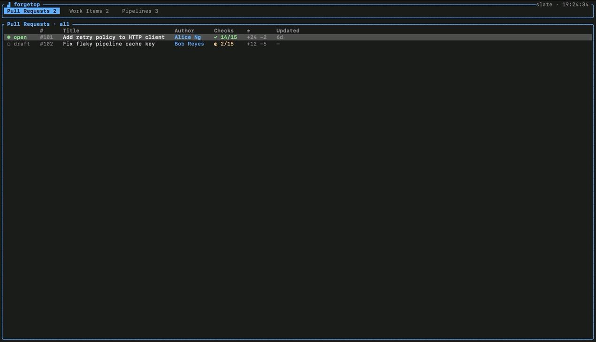

<div align="center">

# forgetop

**htop for your software forges.**

A fast, keyboard-driven terminal UI for your pull requests, work items, and CI
pipelines — across **GitHub**, **Azure DevOps**, and **Linear** — in one place.

</div>

<!-- Replace with a real screen recording once captured. -->
<div align="center">
  
  <br/>
  <sub>Live dashboard — Pull Requests, Work Items, Pipelines.</sub>
</div>

---

## Why

Modern teams spread work across several forges — code review in GitHub, tickets
in Linear, pipelines in Azure DevOps. forgetop pulls them into a single terminal
dashboard so you can triage without tab-hopping. Each section is bound to
whichever provider owns it, and the Pipelines view can aggregate several at once.

## Features

- **Three sections** — Pull Requests, Work Items, and Pipelines, each independently
  bound to a provider. Pipelines can aggregate multiple connections.
- **Do work, not just watch it** — approve / merge / comment on PRs, view coloured
  diffs and review threads, change work-item states, drill into pipeline
  stages → jobs → steps, and trigger runs — all from the keyboard.
- **Multi-provider** — GitHub, Azure DevOps, and Linear, with a built-in `--demo`.
- **Guided setup** — a first-run wizard walks you through adding a connection; a
  config screen manages connections and bindings later.
- **Secure by default** — tokens live in your OS keychain (macOS Keychain, Windows
  Credential Manager, Linux Secret Service). The config file only stores a reference.
- **Yours to shape** — show/hide sections, four colour themes, live auto-refresh.

## Install

Requires a [Rust toolchain](https://rustup.rs) (stable).

```sh
git clone https://github.com/magna-nz/forgetop
cd forgetop
cargo install --path crates/forgetop-cli
```

This builds and installs the `forgetop` binary to `~/.cargo/bin`. Or run it in
place with `cargo run --release`.

## Quick start

Try it with no setup — everything is in-memory, nothing is written:

```sh
forgetop --demo
```

Then run it for real. On first launch (no connections configured) forgetop drops
straight into the **add-connection wizard**:

```sh
forgetop
```

<!-- Replace with a real screen recording once captured. -->
<div align="center">
  
  <br/>
  <sub>The first-run wizard: pick a provider, enter details, paste a token, bind a section.</sub>
</div>

The wizard stores your token in the OS keychain and binds the connection to a
section. Press **`C`** any time to manage connections and bindings.

## Keybindings

forgetop shows a **context-aware key glossary** along the bottom — it only lists
the keys valid for wherever you are. The full set:

### Global

| Key | Action |
| --- | --- |
| `←` / `→`, `h` / `l`, `Tab`, `1`–`3` | Switch tab |
| `↑` / `↓`, `k` / `j` | Move selection |
| `o` | Open selected item in browser |
| `n` | Add a connection (wizard) |
| `v` | Choose which tabs are visible |
| `C` | Config / connections screen |
| `r` | Refresh · `t` cycle theme |
| `q` / `Ctrl-C` | Quit · `Esc` back / close |

### Pull Requests

| Key | Action |
| --- | --- |
| `Enter` | Expand details |
| `f` | Cycle filter (All / Mine / Review-requested) |
| `d` | Open diff + review threads |
| `a` / `x` | Approve / request changes |
| `m` | Merge (choose strategy) |
| `c` | Comment |

### Work Items

| Key | Action |
| --- | --- |
| `Enter` | Expand details |
| `s` | Change state |
| `c` | Comment |

### Pipelines

| Key | Action |
| --- | --- |
| `Enter` | Drill in (stages → jobs → steps) |
| `T` | Trigger a run |

## Configuration

Config is a small JSON file, created and managed for you:

| OS | Path |
| --- | --- |
| macOS | `~/Library/Application Support/forgetop/config.json` |
| Linux | `~/.config/forgetop/config.json` |
| Windows | `%APPDATA%\forgetop\config.json` |

**It never contains secrets** — only a reference to each token in the keychain.

### Tokens

Tokens are stored in your OS keychain under the service name `forgetop`. In
headless environments (CI, containers) you can instead supply a token via an
environment variable named `FORGETOP_PAT_<CONNECTION_ID>` (uppercased;
non-alphanumeric characters become `_`).

### Token scopes

| Provider | What to create | Scopes |
| --- | --- | --- |
| **GitHub** | Personal access token | `repo` (PRs, issues, checks); `workflow` / Actions read for pipelines |
| **Azure DevOps** | Personal access token | Code *Read*, Work Items *Read & Write*, Build *Read & Execute* |
| **Linear** | Personal API key (Settings → Security & access → API) | default |

## Themes

Cycle with `t`. Four built-in themes — `slate` (default), `dark`, `light`, and
`matrix` — using 256-colour palettes so they render correctly on every terminal.
Your choice is remembered.

## How it works

forgetop is a Rust [Cargo workspace](https://doc.rust-lang.org/cargo/reference/workspaces.html):

| Crate | Responsibility |
| --- | --- |
| `forgetop-core` | Domain model, capability-scoped provider traits, config, secrets, services |
| `forgetop-providers` | GitHub, Azure DevOps, Linear, and Demo implementations |
| `forgetop-tui` | The [ratatui](https://ratatui.rs) terminal UI |
| `forgetop-cli` | The `forgetop` binary |

Providers advertise *capabilities* (which sections they support), so a connection
only offers what it can actually do — Linear appears for Work Items but not Pull
Requests, for example.

## Development

```sh
cargo test        # run the test suite
cargo clippy      # lint
cargo run -- --demo
```

## License

[MIT](LICENSE)
