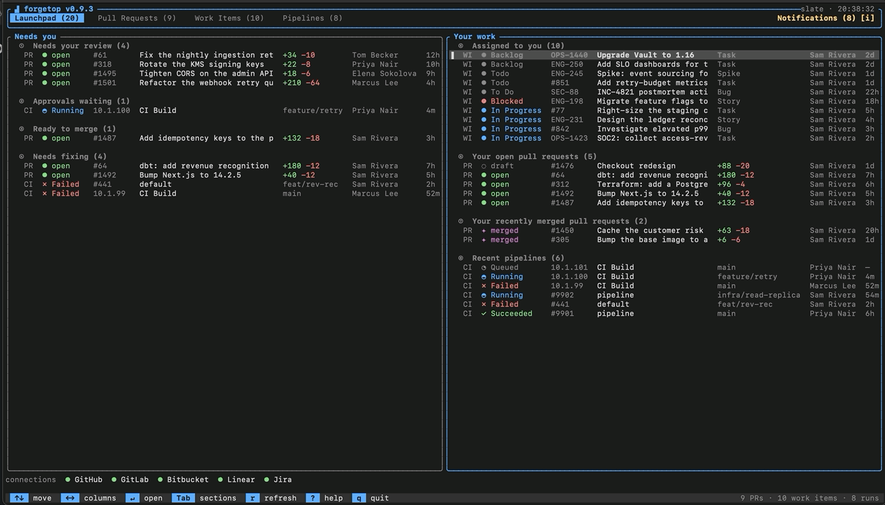
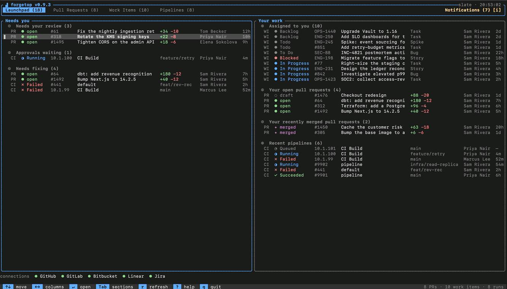
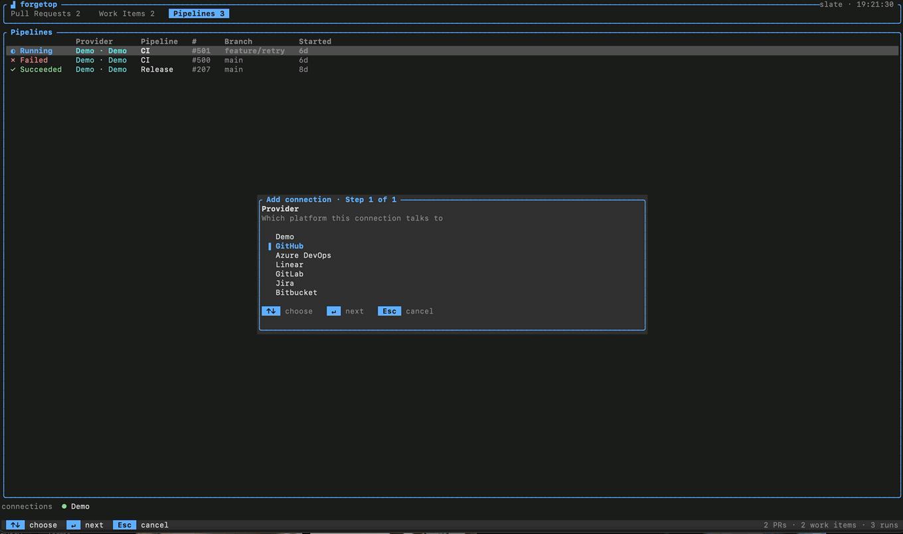

# forgetop

A fast, keyboard-driven terminal UI for your pull requests, work items, and CI
pipelines - across **GitHub**, **GitLab**, **Azure DevOps**, **Linear**, **Jira**,
and **Bitbucket** - in one place.

📖 **Docs: [magna-nz.github.io/forgetop](https://magna-nz.github.io/forgetop/)**

[](https://github.com/magna-nz/forgetop/actions/workflows/ci.yml)
[](https://github.com/magna-nz/forgetop/releases/latest)
[](https://magna-nz.github.io/forgetop/)
[](https://www.rust-lang.org)
[](LICENSE)

<div align="center">
  
  <br/>
  <sub>Live dashboard - Pull Requests, Work Items, Pipelines.</sub>
</div>

---

Modern teams spread work across several forges. forgetop pulls your pull requests,
work items, and pipelines into one terminal dashboard - and lets you *act* on them
(approve, merge, comment, change state, drill into pipeline stages, trigger runs)
without leaving the keyboard. Tokens live in your OS keychain, never in plaintext.

## The Launchpad

forgetop opens on the **Launchpad** - one cross-provider queue answering *what needs me
right now?* Every PR, work item, and pipeline that needs you - across every connected
forge - lands on a single page, ordered by urgency, in two columns:

- **Needs you** - reviews requested of you, pipeline gates to approve, PRs ready to
  merge, and anything of yours that's broken.
- **Your work** - your assigned tickets, open PRs, and recent merges.

So instead of checking GitHub for reviews, Azure for failing builds, and Jira for
tickets, you start your day on one triaged list - every item in the same shape, so
they're comparable at a glance - and act on any of them inline. No tab-hopping, nothing
slipping through the cracks.

<div align="center">
  
  <br/>
  <sub>The Launchpad: everything that needs you, across every forge, on one page.</sub>
</div>

See the [Launchpad docs](https://magna-nz.github.io/forgetop/#launchpad) for the full
bucket rules and keys.

## Why forgetop

Two popular TUIs inspired this: [gh-dash](https://github.com/dlvhdr/gh-dash) (GitHub only)
and [azdo](https://github.com/Elpulgo/azdo) (Azure DevOps only). forgetop's angle is
**one keyboard-driven tool across every forge**, with equal footing for code review
*and* CI.

| Capability | forgetop | gh-dash | azdo |
| :--- | :---: | :---: | :---: |
| Forges supported | **6** | GitHub | Azure |
| Cross-provider action inbox (Launchpad) | ✅ | ❌ | ❌ |
| Cross-provider notification inbox | ✅ | ❌ | ❌ |
| PRs + Work items + Pipelines | ✅ | PRs only | ✅ Azure |
| Act (approve / merge / comment) | ✅ | ✅ PRs | partial |
| Inline line-comment review | ✅ | preview | ❌ |
| Pipeline drill-in + logs | ✅ | ❌ | ✅ |
| Approve pipeline gates in-terminal | ✅ | ❌ | ❌ |
| Filter · sort · saved prefs | ✅ | ✅ | limited |
| Fuzzy command palette (jump to anything) | ✅ | ❌ | ❌ |
| Cross-provider aggregation | ✅ | ❌ | ❌ |
| Desktop notifications | ✅ | ❌ | ❌ |
| Tokens in OS keychain | ✅ | via `gh` | PAT |

## Providers

**GitHub · GitLab · Azure DevOps · Bitbucket · Linear · Jira** (plus a built-in `--demo`).
Each section — Pull Requests, Work Items, Pipelines — binds to the forges that serve it, and
Pipelines can aggregate several at once. For exactly what each provider serves (and the
notification-feed support), see the
[capability matrix](https://magna-nz.github.io/forgetop/#providers-and-capabilities).

## Install

**Homebrew** (macOS / Linux):

```sh
brew install magna-nz/tap/forgetop
```

**Shell installer** (macOS / Linux):

```sh
curl --proto '=https' --tlsv1.2 -LsSf https://github.com/magna-nz/forgetop/releases/latest/download/forgetop-installer.sh | sh
```

**Windows** (PowerShell):

```powershell
irm https://github.com/magna-nz/forgetop/releases/latest/download/forgetop-installer.ps1 | iex
```

Or grab a prebuilt binary for your platform from the
[latest release](https://github.com/magna-nz/forgetop/releases/latest) (macOS
Apple Silicon + Intel, Linux x86_64 + arm64, Windows x86_64).

## Quick start

Try it with no setup - everything is in-memory, nothing is written:

```sh
forgetop --demo
```

It opens on the **[Launchpad](https://magna-nz.github.io/forgetop/#launchpad)** — your
triaged queue across both demo connections; press `Tab` (or `2`–`4`) for the per-type
lists.

Then run it for real:

```sh
forgetop
```

On first launch — before any connection has a token — forgetop **opens the web
dashboard in your browser** to set them up (or skip). Pick a provider, paste a
token, choose which sections it feeds; it's stored in your OS keychain and shared
straight back to the terminal. Press **`C`** in the TUI any time to reopen the
connections page.

<div align="center">
  
  <br/>
  <sub>Setting up a connection: pick a provider, paste a token, choose sections.</sub>
</div>

If something isn't connecting, run `forgetop doctor` — it checks your config,
keychain access, and each connection's token + connectivity.

## Web dashboard

Prefer a browser? forgetop ships the **same UI as a local web dashboard** — the
Launchpad, all three lists, PR review with an inline-comment diff viewer, a
command palette (`⌘K`), and every write action (approve, merge, comment,
transition, approve a deploy gate, mark read).

- **From the TUI:** press **`B`** to open it — running `forgetop` already serves
  it in the background.
- **Headless:** `forgetop --dashboard` serves it and opens your browser (no TTY
  needed — handy over SSH with a forwarded port).

By default `forgetop` opens **both** the terminal UI and the dashboard together.
Change that under **Settings → When forgetop starts** (or press **`,`** in the
TUI): *dashboard + terminal* (default), *terminal only*, or *dashboard only*. The
choice is stored in your config and shared between the two.

It binds to **`127.0.0.1` only** and is gated by a **per-session token** baked
into the URL, so nothing else on your machine (or a web page you visit) can reach
your data or act on your behalf. The dashboard is built into the binary — no
separate install, no external network.

## Documentation

forgetop shows a **context-aware key glossary** along the bottom, so you rarely
need a reference. The full docs live at **[magna-nz.github.io/forgetop](https://magna-nz.github.io/forgetop/)**:

- [Launchpad](https://magna-nz.github.io/forgetop/#launchpad) - the cross-provider action inbox
- [Keybindings](https://magna-nz.github.io/forgetop/#keybindings) - every key, per screen
- [Configuration &amp; tokens](https://magna-nz.github.io/forgetop/#configuration) - config paths, keychain, token scopes per provider
- [Themes](https://magna-nz.github.io/forgetop/#themes)
- [How it works](https://magna-nz.github.io/forgetop/#how-it-works) - architecture

## Contributing

```sh
cargo test        # run the test suite
cargo clippy      # lint
cargo run -- --demo
```

See [How it works](https://magna-nz.github.io/forgetop/#how-it-works) for the crate layout,
and [INTEGRATION.md](INTEGRATION.md) for the live provider integration tests.

## License

[MIT](LICENSE)
