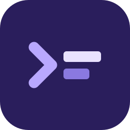
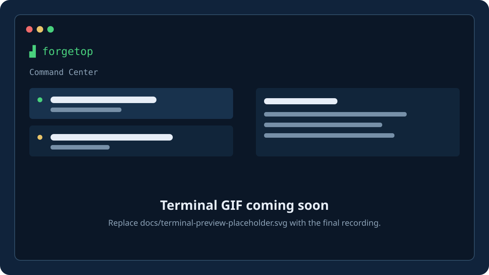
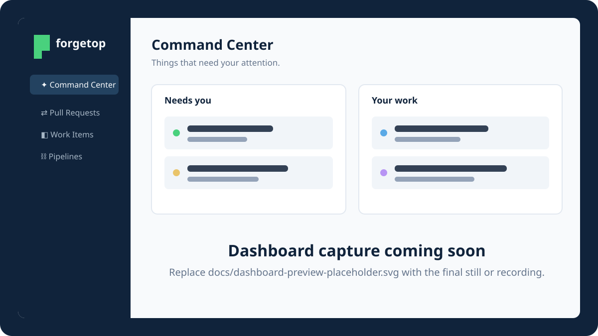

<div align="center">
  
  <h1>forgetop</h1>
  <p><strong>Your work, across every forge — in one command center.</strong></p>
  <p>A fast, keyboard-driven home for pull requests, work items, and CI pipelines in your terminal, browser, or both.</p>
  <p>
    <a href="https://github.com/magna-nz/forgetop/actions/workflows/ci.yml"></a>
    <a href="https://github.com/magna-nz/forgetop/releases/latest"></a>
    <a href="https://magna-nz.github.io/forgetop/"></a>
    <a href="https://discord.gg/yebAJdcGu"></a>
    <a href="LICENSE"></a>
  </p>
  <p><a href="#install">Install</a> · <a href="#quick-start">Quick start</a> · <a href="#the-command-center">Command Center</a> · <a href="https://magna-nz.github.io/forgetop/">Documentation</a> · <a href="https://discord.gg/yebAJdcGu">Discord</a></p>
</div>

<br />

<div align="center">
  
  <br />
  <sub><strong>In your terminal</strong> — terminal GIF coming soon</sub>
  <br /><br />
  
  <br />
  <sub><strong>In your browser</strong> — dashboard still or GIF coming soon</sub>
</div>

<br />

Checking GitHub for reviews, Azure for failing builds, and Jira for tickets is a lot of tabs.
forgetop pulls your pull requests, work items, and pipelines into one command center — and lets
you act on them: approve, merge, comment, change state, drill into pipeline stages, and trigger
runs. It supports **GitHub**, **GitLab**, **Azure DevOps**, **Bitbucket**, **Linear**, and
**Jira**. Tokens live in your OS keychain, never in plaintext.

---

## Why forgetop

Your code review, delivery, and planning work is scattered across the tools that own it.
That makes routine questions expensive: *What needs my attention? What is blocked? What can I
ship now?*

forgetop brings the answer into a single, keyboard-first workspace. It aggregates the work that
matters from every connected forge, then lets you take the next action without bouncing among
tabs.

## The Command Center

forgetop opens on the **Command Center** — one queue answering *what needs me right now?*
Everything is ranked by urgency and grouped into two useful views:

- **Needs you** — review requests, pipeline gates, PRs ready to merge, and work that needs fixing.
- **Your work** — assigned tickets, your open PRs, and recent merges.

Every item has the same shape, so pull requests, work items, and pipelines are comparable at a
glance. Open an item, take action, and keep moving. See the [Command Center docs](https://magna-nz.github.io/forgetop/#command-center)
for the full bucket rules and keys.

## What you can do

### Review and ship without context switching

Approve or request changes, merge, comment, reply to threads, and inspect diffs from a single
cross-provider pull-request view. Your review queue is not limited to one forge.

### Keep delivery moving

See CI runs next to the work they affect, drill into stages and logs, trigger a run, and approve
supported pipeline gates without leaving your flow.

### Find the next useful action

The notification inbox collects mentions, review requests, CI failures, and assignments.
The command palette jumps to any item with **`Ctrl-P`** in the terminal or **`⌘K`** in the dashboard.

### Use the interface that fits your day

forgetop is the same app in the terminal and the browser. Start both together, run the browser
dashboard alone, or stay entirely in the TUI — all three use the same local data and actions.

### Keep your tokens local

The browser dashboard is served by forgetop itself on **`127.0.0.1`** with a per-session token.
Your provider tokens live in your OS keychain, never in plaintext or a hosted service.

## Providers

forgetop connects **GitHub, GitLab, Azure DevOps, Bitbucket, Linear, and Jira**. It presents
pull requests, work items, pipelines, and notifications wherever a provider supports them, while
keeping the interaction model consistent across each one. See the [capability matrix](https://magna-nz.github.io/forgetop/#providers-and-capabilities)
for the exact provider support.

## Install

**Homebrew** (macOS / Linux):

```sh
brew install magna-nz/tap/forgetop
```

**Shell installer** (macOS / Linux):

```sh
curl --proto '=https' --tlsv1.2 -LsSf https://github.com/magna-nz/forgetop/releases/latest/download/forgetop-installer.sh | sh
```

**Windows** (PowerShell):

```powershell
irm https://github.com/magna-nz/forgetop/releases/latest/download/forgetop-installer.ps1 | iex
```

Or grab a prebuilt binary for your platform from the
[latest release](https://github.com/magna-nz/forgetop/releases/latest) (macOS
Apple Silicon + Intel, Linux x86_64 + arm64, Windows x86_64).

## Quick start

Try it with no setup — everything is in-memory, nothing is written:

```sh
forgetop --demo
```

It opens on the **[Command Center](https://magna-nz.github.io/forgetop/#command-center)** — your
triaged queue across both demo connections; press `Tab` (or `2`–`4`) for the per-type
lists.

Then run it for real:

```sh
forgetop
```

This opens the **terminal UI and the dashboard together** (the default). On first launch —
before any connection has a token — the dashboard drops into a quick setup: pick a provider,
paste a token, choose which sections it feeds. Tokens go to your OS keychain and are shared
straight back to the terminal. Press **`C`** in the TUI (or open **Settings**) to manage
connections any time.

If something isn't connecting, run `forgetop doctor` — it checks your config, keychain
access, and each connection's token + connectivity.

## Run it your way

- `forgetop` opens the terminal and dashboard together by default.
- Press **`B`** in the TUI to open the browser whenever you need more space, or run
  **`forgetop --dashboard`** for browser-only use.
- Choose *dashboard + terminal*, *terminal only*, or *dashboard only* under
  **Settings → When forgetop starts** (or **`,`** in the TUI).

## Documentation

forgetop shows a **context-aware key glossary** along the bottom, so you rarely
need a reference. The full docs live at **[magna-nz.github.io/forgetop](https://magna-nz.github.io/forgetop/)**:

- [Command Center](https://magna-nz.github.io/forgetop/#command-center) — the cross-provider action inbox
- [Keybindings](https://magna-nz.github.io/forgetop/#keybindings) — every key, per screen
- [Configuration &amp; tokens](https://magna-nz.github.io/forgetop/#configuration) — config paths, keychain, token scopes per provider
- [Themes](https://magna-nz.github.io/forgetop/#themes)
- [How it works](https://magna-nz.github.io/forgetop/#how-it-works) — architecture

## Contributing

```sh
cargo test        # run the test suite
cargo clippy      # lint
cargo run -- --demo
```

See [How it works](https://magna-nz.github.io/forgetop/#how-it-works) for the crate layout,
and [INTEGRATION.md](INTEGRATION.md) for the live provider integration tests.

## License

[MIT](LICENSE)
